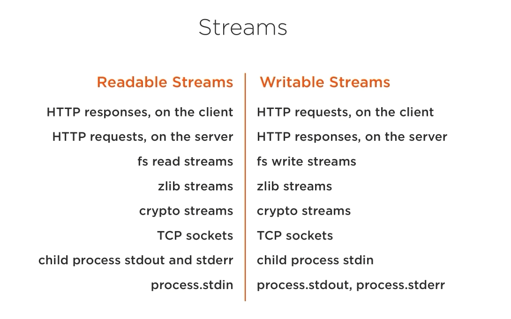

# Stream

stream kế thừa từ class event

có 4 loại stream

\(

duplex va transform khac chi nha ???

\)

stream as a function with input are readable stream part and outut is writable stream

all stream are instance of EventEmitter  
pipe

